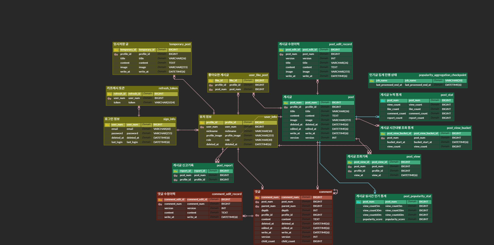

# Infoster

게시글을 통해 정보와 생각을 나누고, 댓글과 답글로 소통하는 커뮤니티 서비스의 백엔드입니다.

## Back-end 소개

- Spring Boot와 MySQL 기반의 REST API 서버입니다.
- 회원, 게시글, 댓글, 임시저장, 좋아요, 신고, 인기글 기능을 제공합니다.
- JWT 기반의 stateless 인증을 적용하고 Refresh Token은 HttpOnly Cookie로 관리합니다.
- 게시글 및 프로필 이미지는 AWS S3에 저장합니다.
- Controller-Service-Repository 계층을 분리하고 도메인 단위로 패키지를 구성했습니다.
- 인기글 집계와 Caffeine 로컬 캐시를 통해 반복 조회 시 데이터베이스 부하를 줄였습니다.

### 개발 정보

- 개발 기간: 2026.06.01 ~ 2026.08.09
- 개발 인원: 프론트엔드 / 백엔드 1명

### Front-end

- [Infoster Front-end GitHub](https://github.com/100-hours-a-week/KTB4_Dave_Full_Week7)

## 주요 기능

### 회원 및 인증

- 회원가입, 로그인, 로그아웃, 회원탈퇴
- 이메일 및 닉네임 중복 확인
- BCrypt 비밀번호 암호화 및 비밀번호 변경
- Access Token 재발급과 Refresh Token 회전
- 프로필 정보 및 프로필 이미지 수정

### 게시글

- 게시글 등록, 조회, 수정, 삭제
- 페이지네이션과 최신순 등 정렬 조회
- 내가 작성한 게시글 및 좋아요한 게시글 조회
- 게시글 좋아요와 신고
- S3 기반 게시글 이미지 관리

### 댓글

- 댓글 등록, 조회, 수정, 삭제
- 답글 등록 및 댓글·답글 페이지네이션

### 임시저장

- 임시 게시글 등록, 목록·상세 조회, 수정, 삭제
- 임시저장 이미지를 게시글 등록 시 재사용하여 불필요한 S3 업로드 방지

### 인기글

- 5분 단위 조회 버킷을 이용한 인기 점수 집계
- 최근 72시간 이내의 게시글 중 상위 10개 제공
- 삭제되거나 블라인드 처리된 게시글 제외
- 인기 목록, 본문, 상태, 첫 댓글 페이지를 Caffeine으로 캐싱
- 트랜잭션 커밋 이후 변경 이벤트에 따라 관련 캐시 무효화

### 요청 보호

- Spring Security와 JWT 필터 기반 인증·인가
- Bucket4j 기반 IP별 요청 횟수 제한
- Bean Validation과 전역 예외 처리를 통한 일관된 오류 응답

## 기술 스택

| 구분 | 기술 |
| --- | --- |
| Language | Java 21 |
| Framework | Spring Boot 4.0.6, Spring MVC, Spring Security |
| Data | Spring Data JPA, JDBC, MySQL 8, H2 |
| Authentication | JWT (JJWT 0.13.0), BCrypt |
| Storage | AWS S3 |
| Cache / Traffic | Caffeine, Bucket4j |
| Test | JUnit 5, Spring Boot Test, JaCoCo, k6 |
| Infra | Docker, Docker Compose, Nginx |
| Build | Gradle |

## 프로젝트 구조

<details>
<summary>폴더 구조 보기</summary>

```text
.
├── deploy/                         # 운영 Docker Compose 및 환경 변수 예시
├── load-test/                      # k6 부하 테스트 환경과 실행 스크립트
├── scripts/                        # 배포 자동화 스크립트
├── src/
│   ├── main/
│   │   ├── java/com/example/community/
│   │   │   ├── auth/               # 토큰 발급·갱신과 Refresh Token
│   │   │   ├── cache/              # 인기글 캐시 무효화
│   │   │   ├── comment/            # 댓글과 답글
│   │   │   ├── configuration/      # Security, CORS, S3, Cache 설정
│   │   │   ├── filter/             # JWT, Rate Limit 필터
│   │   │   ├── handler/            # 전역 예외 처리
│   │   │   ├── post/               # 게시글, 인기글, 조회 집계
│   │   │   ├── temporaryPost/      # 임시 게시글
│   │   │   ├── user/               # 회원 계정과 프로필
│   │   │   └── util/               # JWT 및 이미지 처리 유틸리티
│   │   └── resources/
│   │       ├── application.yaml
│   │       └── db/mysql/schema.sql
│   └── test/                        # Controller, Service, Repository 단위 테스트
├── Dockerfile
├── build.gradle
└── README.md
```

</details>

## 서버 설계

| 도메인 | Controller | Service | Repository |
| --- | --- | --- | --- |
| 인증 | `AuthController` | `AuthService`, `RefreshTokenService` | `RefreshTokenRepository` |
| 회원 | `UserAccountController`, `UserProfileController`, `LikedPostController` | 계정 Command, 프로필 Command, 조회 Service | `SignInfoRepository`, `UserInfoRepository`, `UserLikeRepository` |
| 게시글 | `PostController`, `AdminPostController` | 게시글 Command·Query·Interaction, 인기글 Service | 게시글, 조회, 신고, 인기 통계 Repository |
| 댓글 | `CommentController`, `AdminCommentController` | 댓글 Command·Query Service | `CommentRepository`, `CommentEditRepository` |
| 임시저장 | `TemporaryPostController` | 임시글 Command·Query Service | `TemporaryPostRepository` |

요청은 Security Filter Chain을 거쳐 Controller로 전달되며, Service가 비즈니스 규칙과 트랜잭션을 처리하고 Repository가 MySQL에 접근합니다. 인증된 사용자 정보는 커스텀 Argument Resolver를 통해 Controller에 전달됩니다.

## API 개요

| 도메인 | 기본 경로 | 주요 기능 |
| --- | --- | --- |
| 인증 | `/auth` | Access Token 재발급 |
| 회원 | `/users` | 가입, 로그인·로그아웃, 중복 확인, 프로필·비밀번호 수정, 탈퇴 |
| 게시글 | `/posts` | CRUD, 내 게시글, 좋아요, 신고, 인기글 |
| 댓글 | `/comments` | 댓글·답글 CRUD 및 페이지 조회 |
| 임시저장 | `/temporaryPost` | 임시 게시글 CRUD |
| 관리자 | `/admin` | 게시글·댓글과 수정 이력 조회 |

## 데이터베이스 설계

### 요구사항 분석

`회원 및 인증`

- 이메일과 닉네임의 중복을 방지하고 계정 정보와 프로필 정보를 분리해 관리합니다.
- Refresh Token을 별도 저장하여 재발급과 로그아웃 시 토큰 수명주기를 관리합니다.

`게시글`

- 작성자, 제목, 본문, 이미지, 작성·수정 시각과 게시글 상태를 관리합니다.
- 좋아요, 신고, 조회수, 수정 이력을 각각 추적합니다.

`댓글`

- 게시글에 속한 댓글과 부모 댓글을 참조하는 답글을 관리합니다.
- 댓글 수정 이력을 별도 저장합니다.

`임시저장 및 인기글`

- 사용자의 임시 게시글과 이미지를 관리합니다.
- 조회 이벤트를 5분 버킷으로 기록하고 인기 통계 및 집계 체크포인트를 관리합니다.

`삭제 정책`

- 기본적으로 soft delete 정책을 사용하여 사용자가 데이터를 삭제해도 db 상에 남아있도록 deleted_at 컬럼을 통해 삭제 상태를 관리합니다.

### E-R Diagram

요구사항을 기반으로 모델링한 E-R Diagram입니다.

<p align="center"></p> 


## 기술적 고민 및 개선

### Redis 대신 Caffeine을 선택한 이유

- 현재 백엔드가 단일 인스턴스로 운영되고 있어 인스턴스 간 캐시 공유와 동기화가 필요하지 않습니다.
- 별도의 Redis 서버를 운영할 때 발생하는 네트워크 통신과 관리 비용보다 애플리케이션 내부 로컬 캐시의 단순성과 빠른 접근 속도가 현재 환경에 적합하다고 판단했습니다.
- 이에 따라 인기글 목록과 상세 데이터 캐시에 Caffeine을 사용하고, TTL과 최대 크기 및 가중치 기반 퇴거 정책으로 제한된 JVM 메모리를 관리했습니다.
- 향후 백엔드를 다중 인스턴스로 확장할 경우 로컬 캐시 간 정합성 문제가 생길 수 있으므로 Redis와 같은 분산 캐시 도입을 재검토할 예정입니다.

### 인기글 조회 부하 개선

- 요청 시마다 원본 조회 데이터를 집계하지 않고, 완료된 5분 버킷만 증분 집계하도록 구성했습니다.
- 인기 목록 스냅샷과 상세 데이터 일부를 캐싱해 반복 조회의 데이터베이스 접근을 줄였습니다.
- 제한된 컨테이너 메모리에서도 동작하도록 TTL, 최대 엔트리 수와 가중치 기반 퇴거 정책을 적용했습니다.

### 캐시 정합성 관리

- 게시글과 댓글 변경 이벤트는 트랜잭션 커밋 이후에만 캐시를 무효화합니다.
- 목록, 본문, 상태, 댓글을 분리해 변경 범위에 필요한 캐시만 제거합니다.
- 삭제되거나 신고 누적으로 블라인드된 게시글은 인기 목록과 관련 캐시에서 제외합니다.

### 이미지 업로드 최적화

- 이미지 URL과 S3 `objectKey`의 역할을 분리했습니다.
- 기존 이미지를 유지할 때 파일을 다시 업로드하지 않고 `objectKey`를 검증해 재사용합니다.
- 임시 게시글 이미지를 최종 게시글로 전환할 때도 기존 S3 객체를 재사용합니다.
